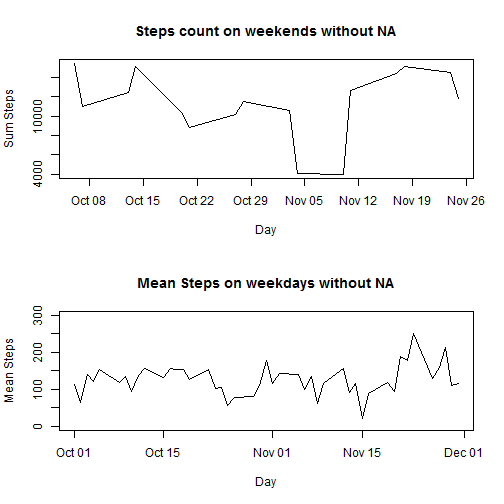

Reproducible Research: Peer Assessment 1
==========================================
Author: Kapil Wadodkar
Repo: https://github.com/wkapil/RepData_PeerAssessment1

## Loading and preprocessing the data
Loading data from csv file and formulating dataset.

```r
activityData  <- read.csv("activity.csv", header=TRUE)
dataTable        <- data.table(activityData)
```
Correcting data.

```r
dataTable$steps  <- as.integer(dataTable$steps)
dataTable$day    <- as.Date(activityData$date,"%Y-%m-%d")
```


## What is mean total number of steps taken per day?
Calculating steps taken per day in ```{r}workingData``` variable.

```r
workingData <- dataTable[ dataTable$steps != 0
                          ,list(
                            sum    = sum(steps,na.rm=TRUE)
                            , mean   = mean(steps,na.rm=TRUE) 
                            , median = as.double( median(steps,na.rm=TRUE) )
                          )
                          ,by=day
                          ]
```

## What is the average daily activity pattern?
Calculate Mean for 5 minute interval.

```r
workingData2 <- dataTable[ dataTable$steps != 0
                           ,list( 
                             AvgSteps = mean(steps,na.rm=TRUE) )
                           ,by=interval
                           ]

print("Maximum Average Number of steps by Interval:" )
```

```
## [1] "Maximum Average Number of steps by Interval:"
```

```r
print(workingData2[workingData2$AvgSteps == max(workingData2$AvgSteps)])
```

```
##    interval AvgSteps
## 1:      835    352.5
```

## Imputing missing values
Find missing values with NA

```r
dataTableNoNas <- data.table(dataTable)
print(c("Missing Values count:", dim( dataTableNoNas[ is.na(dataTableNoNas$steps) ] )[1], "NAs" ))
```

```
## [1] "Missing Values count:" "2304"                  "NAs"
```
Data imputate for NA values.

```r
dataTableNoNas$steps <- ifelse( is.na(dataTableNoNas$steps), 
                                workingData2$AvgSteps[ dataTableNoNas$interval ], 
                                dataTableNoNas$steps 
								)
```
Mean values for the new data set.

```r
workingData4 <- dataTableNoNas[ dataTableNoNas$steps != 0
                                ,list( 
                                  AvgSteps = mean(steps,na.rm=TRUE) )
                                ,by=interval
                                ]

print("Max Avg steps:" )
```

```
## [1] "Max Avg steps:"
```

```r
print(workingData4[workingData4$AvgSteps == max(workingData4$AvgSteps)])
```

```
##    interval AvgSteps
## 1:      835    352.5
```

## Are there differences in activity patterns between weekdays and weekends?
Sorting data for Weekdays and Weekends.

```r
weekDayVector <- weekdays(dataTableNoNas$day)
saturdayVector <- weekDayVector=="Saturday"
sundayVector <- weekDayVector=="Sunday"
weekEndVector <- saturdayVector | sundayVector	
dataTableNoNas <- cbind(dataTableNoNas, weekEndVector)

weekEnddataTable <- dataTableNoNas[dataTableNoNas$weekEndVector == TRUE,]
weekDaydataTable <- dataTableNoNas[dataTableNoNas$weekEndVector == FALSE,]

workingData4 <- weekEnddataTable[ weekEnddataTable$steps != 0
                                  ,list(
                                    sum    = sum(steps,na.rm=TRUE)
                                    , mean   = mean(steps,na.rm=TRUE) 
                                    , median = as.double( median(steps,na.rm=TRUE) )
                                  )
                                  ,by=day
                                  ]


workingData5 <- weekDaydataTable[ weekDaydataTable$steps != 0
                                  ,list(
                                    sum    = sum(steps,na.rm=TRUE)
                                    , mean   = mean(steps,na.rm=TRUE) 
                                    , median = as.double( median(steps,na.rm=TRUE) )
                                  )
                                  ,by=day
                                  ]	
```
Plotting graph for Weekday and Weekend data

```r
def.par <- par(no.readonly = TRUE)

par(mfrow=c(2,1)) 

plot( x = workingData4$day , type = "l", xlab = "Day", 
      y = workingData4$sum , ylab = "Sum Steps", 
      main = "Steps count on weekends without NA")

plot( x = workingData5$day, type = "l", xlab = "Day", 
      y = workingData5$mean , ylab = "Mean Steps" , ylim=c(0, 300), 
      main = "Mean Steps on weekdays without NA")
```

 

```r
par(def.par)
```
